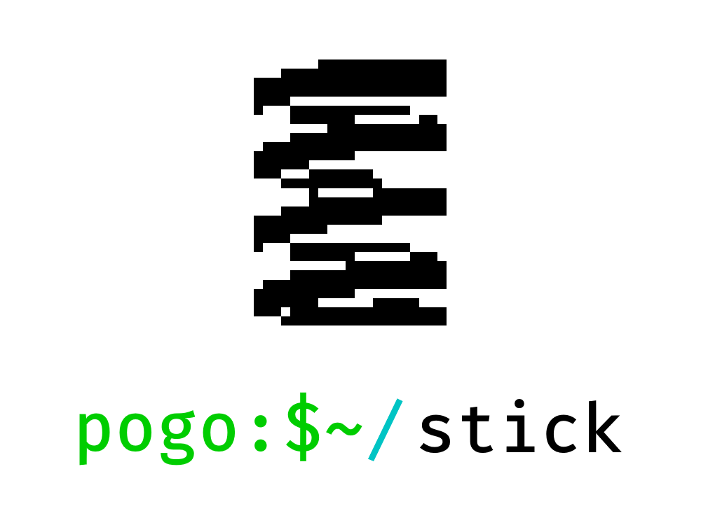

     
    
    

# Pogostick
Pogostick is a work-in-progress hobby operating system which runs on the `x86_64` architecture. I'm using the project to learn all about operating system and low-level software development, as well as improve at the Rust programming language. The project began with [phil-opp](https://github.com/phil-opp)'s [Writing an OS in Rust](https://os.phil-opp.com/) tutorial, but this has since been built upon with many additional features.

## Features
| Status | Feature |
| --- | --- |
|✔️ Working | Hello World |
|✔️ Working | Stack allocation |
|✔️ Working | Heap allocation |
|✔️ Working | VGA text mode output |
|✔️ Working | Console with basic commands |
|✔️ Working | ATA PIO disk driver |
|✔️ Working | Basic FAT-inspired filesystem ([PFS](doc/filesystem.md)) |
|🚧 In Progress | "Full" filesystem functionality such as delete, rename etc. |
|🛠️ Planned | External (outside of Pogostick) filesystem access with a CLI |
|🛠️ Planned | Basic text editor similar to `nano` |
|🛠️ Planned | Executable programs |